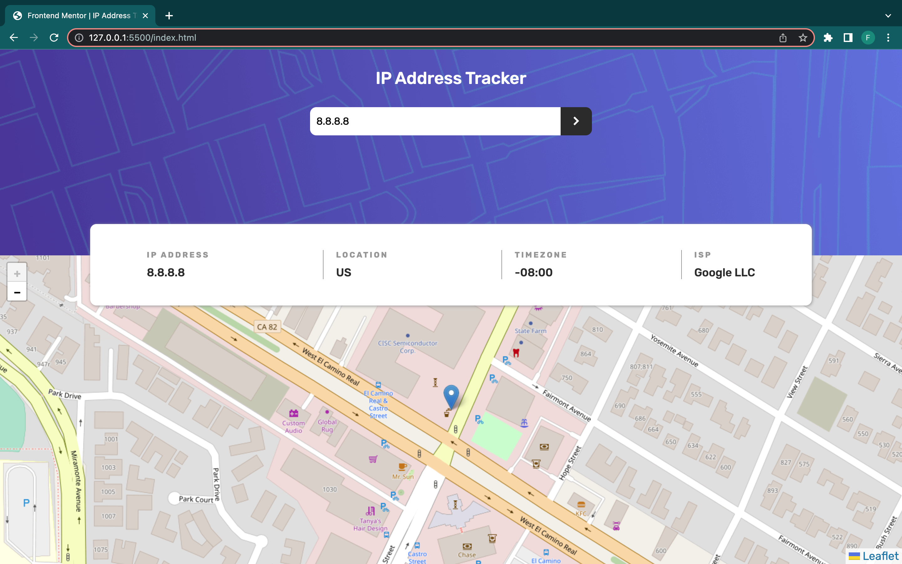
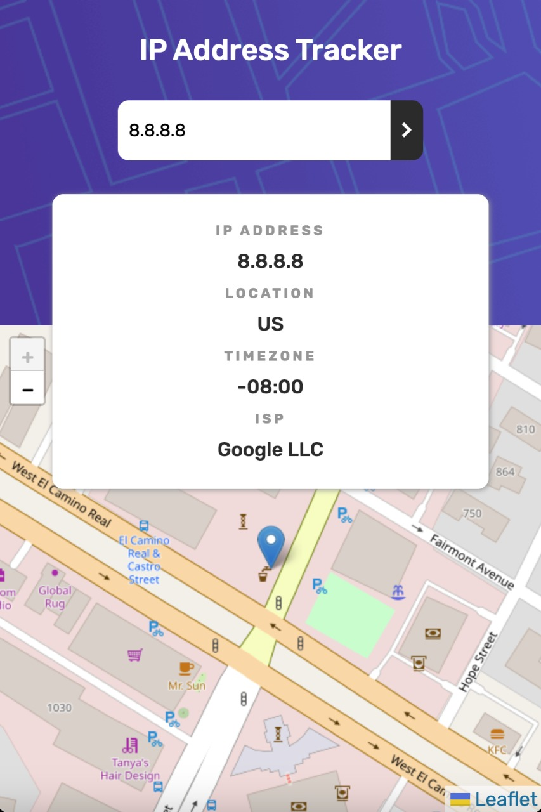

# Frontend Mentor - IP address tracker solution

This is a solution to the [IP address tracker challenge on Frontend Mentor](https://www.frontendmentor.io/challenges/ip-address-tracker-I8-0yYAH0). Frontend Mentor challenges help you improve your coding skills by building realistic projects.

## Table of contents

- [Overview](#overview)
  - [The challenge](#the-challenge)
  - [Screenshot](#screenshot)
  - [Links](#links)
- [My process](#my-process)
  - [Built with](#built-with)
  - [How to use lealetjs](#How-to-use-lealetjs)
- [Author](#author)

## Overview

### The challenge

Users should be able to:

- View the optimal layout for each page depending on their device's screen size
- See hover states for all interactive elements on the page
- See their own IP address on the map on the initial page load
- Search for any IP addresses or domains and see the key information and location

### Screenshot




### Links

- Solution URL: [](https://github.com/FaisalKhan2000/Ip-Address-Tracker)
- Live Site URL: [](https://ip-address-tracker-faisalkhan.netlify.app/)

## My process

### Built with

- Semantic HTML5 markup
- CSS custom properties
- Flexbox
- Javascript
- IP Geolocation API
- Leafletjs

### How to use lealetjs

```js
let mapOptions = {
  center: [latitude, longitude],
  zoom: 20,
};

// Creating a map object
let map = new L.map("map", mapOptions);

// Creating a Layer object
let layer = new L.TileLayer(
  "http://{s}.tile.openstreetmap.org/{z}/{x}/{y}.png"
);

// Adding layer to the map
map.addLayer(layer);

// Add a location marker
L.marker([latitude, longitude]).addTo(map);
```

## Author

- Frontend Mentor - [@FaisalKhan2000](https://www.frontendmentor.io/profile/FaisalKhan2000)
- Twitter - [@faisal_khan2k](https://twitter.com/faisal_khan2k)
